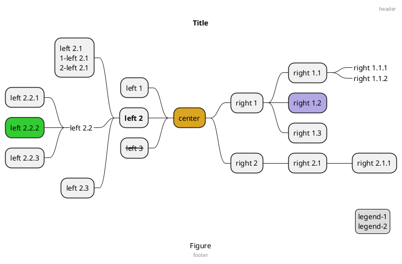

---
{"dg-publish":true,"permalink":"/main/4-semester/emner/mindmap/","title":"Mindmap","created":"2024-08-14T06:38:41.202+02:00"}
---

```plantuml
@startmindmap
+[#goldenrod] center
++ right 1
+++ right 1.1
++++_ right 1.1.1
++++_ right 1.1.2
+++[#B4A7E5] right 1.2
+++ right 1.3
++ right 2
+++ right 2.1
++++ right 2.1.1
-- left 1
-- **left 2**
--- left 2.1\n1-left 2.1\n2-left 2.1
---_ left 2.2
---- left 2.2.1
----[#limegreen] left 2.2.2
---- left 2.2.3
--- left 2.3
-- <s>left 3</s>
caption Figure
Title Title
header
header
endheader
center footer footer
legend right
legend-1
legend-2
endlegend
@endmindmap
```
