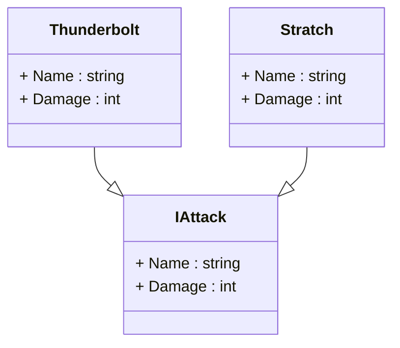
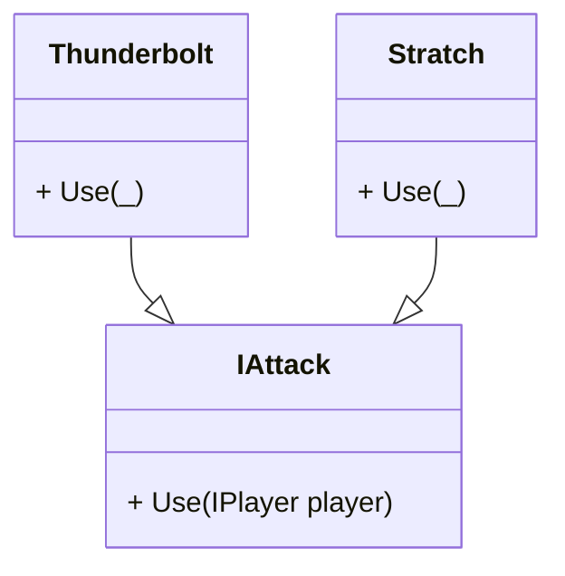
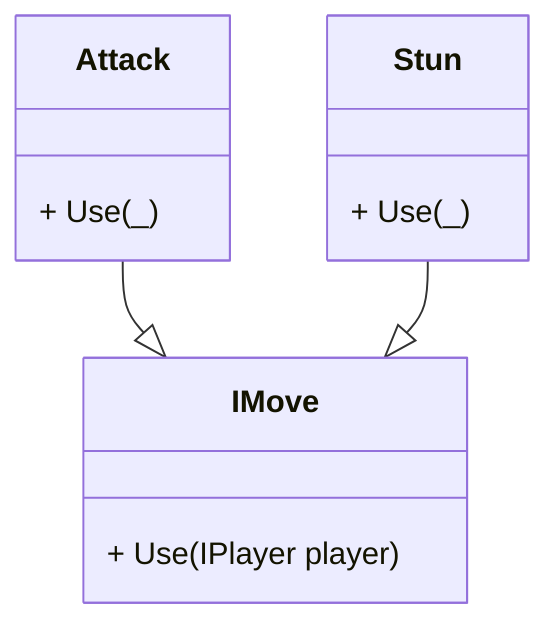

---
{"dg-publish":true,"permalink":"/main/artikler/data-vs-adaerd/","title":"Data vs Adfærd","tags":["Objektorienteret_Programmering"],"dgHomeLink":"false","dgShowBacklinks":"false","dgShowLocalGraph":"false","dgShowFileTree":"false","dgEnableSearch":"false","dgShowToc":"false","created":"2024-06-19T08:43:14.420+02:00"}
---

Se hvad jeg ellers har skrevet [[Main/Artikler/Artikler jeg har skrevet\|her]]

---
## Hvornår skal man bruge Polymorfisme?

Polymorfisme er en grundpille i objektorienteret programmering (OOP), som muliggør, at forskellige objekter kan reagere forskelligt på samme metodekald. Når vi designer klasser, er det vigtigt at overveje, hvornår polymorfisme giver mening. En grundregel er, at polymorfisme kun bør anvendes, når der er forskel i **adfærd** mellem klasserne.
### Eksempel: Angreb i et spil

Lad os udforske polymorfisme ved hjælp af et eksempel fra et spil, hvor vi har forskellige typer angreb.




Her er to klasser: `Thunderbolt` og `Scratch`, der begge arver fra interfacet `IAttack`. På overfladen ser det ud som et fint design. Men hvis vi undersøger det nærmere, har vi kun variation i **data** (fx forskellige værdier for `Name` og `Damage`), mens adfærden forbliver den samme: Begge angreb reducerer spillerens helbredspoint med en bestemt værdi.

### Når polymorfisme ikke giver mening

Hvis klasserne kun varierer i deres **data** og ikke i deres **adfærd**, er det bedre at bruge objekter i stedet for polymorfisme.

**Opsummering af fejlscenariet:**

- `Thunderbolt` og `Scratch` udfører præcis den samme handling (reducerer helbredspoint).
- Forskellen ligger kun i værdier som `Damage`, hvilket kan håndteres gennem simple objekter i stedet for separate klasser.

#### Bedre løsning uden polymorfisme

I stedet for at oprette flere klasser kan vi bruge en enkelt klasse med data, der beskriver angrebstypen:



---

### Når polymorfisme giver mening

Polymorfisme er værdifuld, når vi har **forskellig adfærd**, dvs. når klasser udfører unikke handlinger. Lad os udvide eksemplet:


Her introduceres to klasser: `Attack` og `Stun`. De implementerer begge interfacet `IMove`, men deres adfærd er vidt forskellig:

- `Attack` reducerer spillerens helbredspoint.
- `Stun` gendanner spillerens helbred til maksimum.

Eksempel i kode:
```csharp
public interface IMove 
{ 
	void Use(IPlayer player); 
} 
public class Attack : IMove 
{
	public int Damage { get; set; } 
	public void Use(IPlayer player) 
	{ 
		player.Health -= Damage; 
	} 
} 
public class Stun : IMove 
{ 
	public void Use(IPlayer player) 
	{ 
		player.Health = player.MaxHealth; 
	} 
}
```
Med dette design kan vi bruge polymorfisme til at håndtere forskellige adfærdsvariationer:

```csharp
IMove move = new Attack { Damage = 50 }; 
move.Use(player); // Reducerer spillerens helbred.  

move = new Stun(); 
move.Use(player); // Gendanner spillerens helbred.
```

>[!important] Huskeregel 
>Variation i adfærd => Klasser.

---
### Opsummering

Designbeslutninger om polymorfisme bør baseres på forskellen mellem **data** og **adfærd**:

- Hvis variationen *kun er i data*, skal du undgå polymorfisme og bruge objekter.
- Hvis variationen *er i adfærd*, giver polymorfisme mening.

#### De gyldne regler:

1. **Variation i Data → Objekter.**  
    Brug én klasse med forskellige objekter til at repræsentere dataforskelle.
    
2. **Variation i Adfærd → Klasser.**  
    Brug polymorfisme til at repræsentere forskellige adfærdsvariationer gennem arv eller interfaces.
    

Med disse retningslinjer kan du skabe et mere vedligeholdbart og effektivt system.

## Andre artikler med samme emne
| File                                                      | Title             | Tags                                                                                                                          |
| --------------------------------------------------------- | ----------------- | ----------------------------------------------------------------------------------------------------------------------------- |
| [[Main/Artikler/LoB vs Clean Code\|LoB vs Clean Code]] | LoB vs Clean Code | <ul><li>#Objektorienteret_Programmering</li><li>#Software_Design</li><li>#Clean_Code</li><li>#Locality_of_Behaviour</li></ul> |

{ .block-language-dataview}
