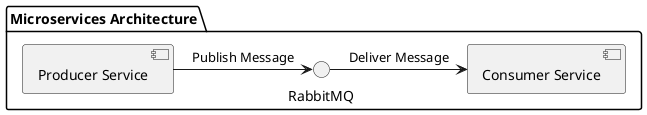

---
{"dg-publish":true,"permalink":"/main/noter/implementering-af-rabbit-mq/","created":"2024-11-20T10:14:10.528+01:00"}
---

## Introduktion

[[Main/Noter/RabbitMQ\|RabbitMQ]] bruges som en [[Main/Noter/Message Brokers\|message broker]] til at facilitere kommunikation mellem [[Main/Noter/Emner/Backend/Microservice\|microservices]]. Denne tilgang decouplerer [[Main/Noter/Emner/Backend/Microservice\|services]], så de kan arbejde *asynkront* og uafhængigt af hinanden.

I denne demo vises:

1. En producer-service, der *sender* beskeder.
2. [[Main/Noter/RabbitMQ\|RabbitMQ]] som en [[Main/Noter/Message Brokers\|message broker]].
3. En Consumer-service, der *modtager* beskeder.

---
## Arkitekturdiagram



### Problematik i Kommunikation mellem Microservices

Når microservices kommunikerer direkte med hinanden, kan følgende udfordringer opstå:

1. **Tight Coupling**: [[Main/Noter/Emner/Backend/Microservice\|Services]] bliver afhængige af hinandens tilgængelighed og implementation, hvilket gør systemet *mindre fleksibelt*.
2. **Skaleringsproblemer:** *Direkte kommunikation* mellem mange [[Main/Noter/Emner/Backend/Microservice\|services]] kan føre til en kompleks netværksarkitektur og belastningsproblemer.
3. **Håndtering af fejl:** Hvis en service går ned, kan det medføre, at afhængige tjenester også fejler, især i real-time systemer.
4. **Kompleks integration:** Ved flere services kan der opstå udfordringer med at sikre, at alle services kan kommunikere korrekt med hinanden.

### Hvordan RabbitMQ som Message Broker Løser Problemet

En message broker som [[Main/Noter/RabbitMQ\|RabbitMQ]] introducerer en [[Main/Noter/Middleware\|middelware]], der hjælper med at håndtere *asynkron kommunikation* mellem [[Main/Noter/Emner/Backend/Microservice\|services]]. Dette giver flere fordele:

1. **Decoupling (Løs kobling):** [[Main/Noter/Emner/Backend/Microservice\|Services]] behøver ikke være online samtidig. Producenten (Producer) kan sende beskeder, som forbrugeren (Consumer) henter senere.
2. **Pålidelighed:** [[Main/Noter/RabbitMQ\|RabbitMQ]] garanterer levering af beskeder og kan gemme dem, indtil de er leveret.
3. **Skalérbarhed:** [[Main/Noter/RabbitMQ\|RabbitMQ]] kan håndtere mange forbindelser og beskeder, hvilket gør systemet mere skalerbart.
4. **Fejlhåndtering:** Hvis en forbruger er midlertidigt nede, gemmer [[Main/Noter/RabbitMQ\|RabbitMQ]] beskeden, indtil forbrugeren er klar igen.

Dette sikrer, at ordrer ikke går tabt, selv hvis lagerstyringsservicen ikke er tilgængelig i øjeblikket. [[Main/Noter/RabbitMQ\|RabbitMQ]] vil gemme beskederne og levere dem, når [[Main/Noter/Emner/Backend/Microservice\|servicen]]  er oppe igen.

Arkitekturen løser således problematikken med *kompleks direkte kommunikation* og sikrer, at [[Main/Noter/Emner/Backend/Microservice\|services]]  kan arbejde uafhængigt af hinanden.

--- 
## Opsætning med docker
```bash
docker run -it --rm --name rabbitmq -p 5672:5672 -p 15672:15672 rabbitmq:4.0-management
```

Denne [[Main/Noter/Docker\|Docker]]-kommando starter en midlertidig [[Main/Noter/RabbitMQ\|RabbitMQ]]-container med det officielle Management-plugin. Den mapper port **5672** ([[Main/Noter/RabbitMQ#AMQP Protokol\|AMQP]]) og **15672** (Management-UI) til din host, så du kan sende/afhente beskeder og overvåge køer via `http://localhost:15672` (standard login: `guest/guest`). Containeren navngives `rabbitmq` og fjernes automatisk ved stop.

---
## Kode eksempel
### Producer
Jeg har implementeret en Producer [her](https://github.com/Abarbesgaard/Vita_Microservice/blob/main/Vitahus_VideoService_Service/RabbitMQ/RabbitMQService.cs)

```csharp
var factory = new ConnectionFactory() { HostName = "localhost" };
using var connection = factory.CreateConnection();
using var channel = connection.CreateModel();

channel.QueueDeclare(queue: "hello",
                     durable: false,
                     exclusive: false,
                     autoDelete: false,
                     arguments: null);

string message = "Hello World!";
var body = Encoding.UTF8.GetBytes(message);

channel.BasicPublish(exchange: "",
                     routingKey: "hello",
                     basicProperties: null,
                     body: body);

```

#### 1. Opret forbindelse til RabbitMQ

```csharp
var factory = new ConnectionFactory() { HostName = "localhost" }; 
using var connection = factory.CreateConnection(); 
using var channel = connection.CreateModel();
```

- **`ConnectionFactory`**: Bruges til at konfigurere og oprette forbindelse til [[Main/Noter/RabbitMQ\|RabbitMQ]]-serveren. `HostName` angiver, at [[Main/Noter/RabbitMQ\|RabbitMQ]] kører lokalt.
- **`CreateConnection`**: Opretter en TCP-forbindelse til [[Main/Noter/RabbitMQ\|RabbitMQ]]-serveren.
- **`CreateModel`**: Opretter en kanal, som er den virtuelle forbindelse, der bruges til at sende beskeder.

> RabbitMQ arbejder med kanaler for effektiv kommunikation mellem klient og server.

#### 2. Opret en kø

```csharp


channel.QueueDeclare(queue: "hello",
					 durable: false,
					 exclusive: false,
					 autoDelete: false,
					 arguments: null
					 );
```
- **`QueueDeclare`**: Sikrer, at [[Main/Noter/RabbitMQ#Queues\|køen]] med navnet `"hello"` eksisterer. Hvis [[Main/Noter/RabbitMQ#Queues\|køen]] allerede er oprettet, genbruger [[Main/Noter/RabbitMQ\|RabbitMQ]] den.
    - `queue: "hello"`: Navnet på køen.
    - `durable: false`: Angiver, at [[Main/Noter/RabbitMQ#Queues\|køen]] ikke overlever en genstart af [[Main/Noter/RabbitMQ\|RabbitMQ]]. (Hvis det sættes til `true`, gemmes [[Main/Noter/RabbitMQ#Queues\|køen]])
    - `exclusive: false`: [[Main/Noter/RabbitMQ#Queues\|Køen]] kan bruges af flere forbindelser, ikke kun den nuværende.
    - `autoDelete: false`: [[Main/Noter/RabbitMQ#Queues\|Køen]] slettes ikke automatisk, når forbindelsen lukkes.
    - `arguments: null`: Ingen ekstra parametre til [[Main/Noter/RabbitMQ#Queues\|køen]].

#### 3. Klargør beskeden

```csharp
string message = "Hello World!"; 
var body = Encoding.UTF8.GetBytes(message);
```

- **`message`**: En simpel tekstbesked, der skal sendes.
- **`Encoding.UTF8.GetBytes`**: Konverterer beskeden til en byte-array, som er det format [[Main/Noter/RabbitMQ\|RabbitMQ]] kræver.
#### 4. Send beskeden

```csharp
channel.BasicPublish(exchange: "",
					 routingKey: "hello",
					 basicProperties: null,
					 body: body
					 );
```

- **`BasicPublish`**: Bruges til at sende en besked til [[Main/Noter/RabbitMQ\|RabbitMQ]].
    - `exchange: ""`: Angiver, at beskeden sendes direkte til [[Main/Noter/RabbitMQ#Queues\|køen]]. Ingen exchange bruges her.
    - `routingKey: "hello"`: Navnet på [[Main/Noter/RabbitMQ#Queues\|køen]], hvor beskeden skal sendes.
    - `basicProperties: null`: Ingen specielle *metadata* for denne besked.
    - `body: body`: Selve beskedens *data* (i byte-format).
### Consumer
Jeg har implementeret en consumer [her](https://github.com/Abarbesgaard/Vita_Microservice/blob/main/Vitahus_VideoService_Service/RabbitMQ/VideoConsumer.cs)

```csharp
var factory = new ConnectionFactory() { HostName = "localhost" };
using var connection = factory.CreateConnection();
using var channel = connection.CreateModel();

channel.QueueDeclare(queue: "hello",
                     durable: false,
                     exclusive: false,
                     autoDelete: false,
                     arguments: null);

var consumer = new EventingBasicConsumer(channel);
consumer.Received += (model, ea) =>
{
    var body = ea.Body.ToArray();
    var message = Encoding.UTF8.GetString(body);
    Console.WriteLine(" [x] Received {0}", message);
};
channel.BasicConsume(queue: "hello",
                     autoAck: true,
                     consumer: consumer);


```
#### 1. Opret forbindelse til RabbitMQ

```csharp
var factory = new ConnectionFactory() { HostName = "localhost" }; 
using var connection = factory.CreateConnection(); 
using var channel = connection.CreateModel();
```
- **`ConnectionFactory`**: Konfigurerer forbindelse til [[Main/Noter/RabbitMQ\|RabbitMQ]]-serveren. `HostName` angiver, at serveren kører lokalt.
- **`CreateConnection`**: Opretter en TCP-forbindelse til [[Main/Noter/RabbitMQ\|RabbitMQ]]-serveren.
- **`CreateModel`**: Opretter en kanal, som bruges til at kommunikere med [[Main/Noter/RabbitMQ\|RabbitMQ]].
#### 2. Sikre eksistensen af køen

```csharp
channel.QueueDeclare(queue: "hello",
					 durable: false,
					 exclusive: false,
					 autoDelete: false,
					 arguments: null
					 );
```

- **`QueueDeclare`**: Sikrer, at [[Main/Noter/RabbitMQ#Queues\|køen]] `"hello"` eksisterer. Dette er vigtigt, fordi consumer'en ikke kan modtage beskeder, hvis [[Main/Noter/RabbitMQ#Queues\|køen]] ikke findes.
    - Samme parametre som i _Producer_-koden:
        - `durable: false`: [[Main/Noter/RabbitMQ#Queues\|køen]] overlever ikke en genstart af [[Main/Noter/RabbitMQ\|RabbitMQ]].
        - `exclusive: false`: [[Main/Noter/RabbitMQ#Queues\|køen]] kan bruges af flere forbindelser.
        - `autoDelete: false`: [[Main/Noter/RabbitMQ#Queues\|køen]] slettes ikke, når forbindelsen lukkes.
#### 3. Opsæt en consumer

```csharp
var consumer = new EventingBasicConsumer(channel); 
consumer.Received += (model, ea) => {     
	var body = ea.Body.ToArray();     
	var message = Encoding.UTF8.GetString(body);     
	Console.WriteLine(" [x] Received {0}", message); 
};
```
- **`EventingBasicConsumer`**: En [[Main/Noter/RabbitMQ\|RabbitMQ]]-standard til at modtage beskeder asynkront.
- **`consumer.Received`**: En event-handler, der udløses, når der modtages en besked.
    - **`ea.Body.ToArray()`**: Konverterer beskedens data fra byte-array til en brugbar form.
    - **`Encoding.UTF8.GetString(body)`**: Dekoder byte-array til en tekststreng.
    - **`Console.WriteLine`**: Viser beskeden i konsollen.
#### 4. Begynd at lytte til køen

```csharp
channel.BasicConsume(queue: "hello",
					 autoAck: true,
					 consumer: consumer);
```
- **`BasicConsume`**: Starter consumeren, så den lytter til [[Main/Noter/RabbitMQ#Queues\|køen]] `"hello"`.
    - `queue: "hello"`: Angiver navnet på [[Main/Noter/RabbitMQ#Queues\|køen]], som consumeren lytter til.
    - `autoAck: true`: Beskeden markeres som leveret automatisk, så snart den er modtaget.
        - Hvis dette sættes til `false`, skal applikationen eksplicit bekræfte leveringen for at undgå tab af beskeder.
---

## Sammenfatning

Med denne opsætning kan du vise, hvordan [[Main/Noter/RabbitMQ\|RabbitMQ]] fungerer som [[Main/Noter/Message Brokers\|message broker]] i en [[Main/Noter/Emner/Backend/Microservice\|microservices-arkitektur]], og hvordan producer- og consumer-tjenester kommunikerer asynkront.

<script> 
console.log("hello") 
</script>