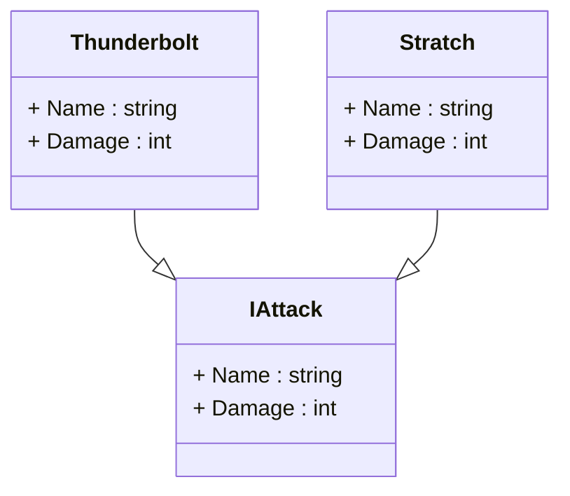
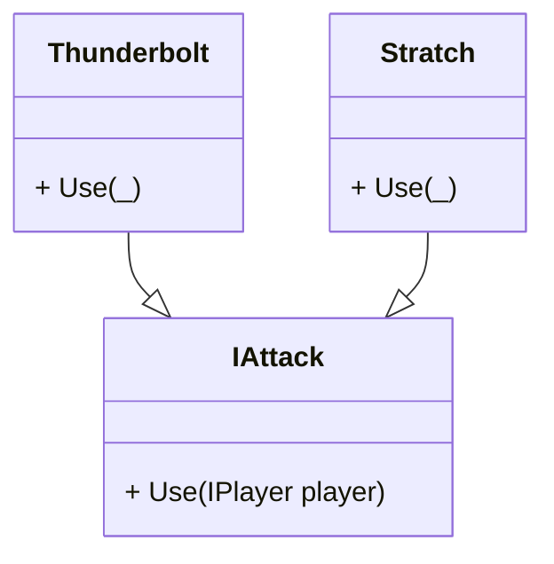
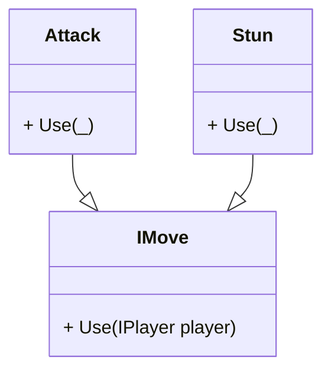

---
{"dg-publish":true,"permalink":"/content/artikler/data-vs-adaerd/","title":"Data vs Adfærd","tags":["Objektorienteret_Programmering"]}
---

# Hvornår skal man bruge Polymorfisme?

Den eneste grund til at have flere forskellige subklasser som arver fra en superklasser er når der er en ændring i **adfærd**.

Lad os tage udgangspunkt i følgende klasse diagram

Her kan vi se *2 klasser* og *1 interface*. 

De to klasser arver fra interface’et.

Lad os se på hvad præcis **Thunderbolt** og **Scratch** er og gør

Forestil dig at alt hvad de to klasser gør er at have et navn og trække en int fra en spillers Health points.

Dette beskriver Christopher i videoen som en ændring i data snarere end en ændring i adfærd. Derfor er det unødvendigt at oprette to underklasser, der arver fra et interface.

Det kan opsummeres sådan:
> [!summary] 
> Ænding i data => objekter

Hvis de to klasser ser sådan ud:

*Name*: Tunderbolt

*Damage* : 100

*Name*: Scratch

*Damage* : 10

Gør vi ikke mere end at ændre data.

Så lad os lave klasse diagrammet om så det passer bedre til at have underklasser.

Nu er der placeret metoder i alle kasser. Det må vel kunne ære adfærden for klasserne, for metoder er vel adfærd?  
 

…Tjoe

Men hvis vi kigger efter i sømmene kan vi forestille os at Use metoden gør det samme som i det første diagram oven for.

fx

_Thunderbolt_ trækker 100 fra Spilleren health points

_Scratch_ trækker 10 fra spillerens Health Points

I bund og grund har de den samme adfærd. 

Alright, sidste forsøg.

Nu er det lavet et interface de hedder _IMove_. Yderligere to klasser som hedder _Attack_ og _Stun_.  
De to klasser har her 2 vidt forskellig adfærd

_Attack_ trækker et heltal fra spillerens health points

_Stun_ returnerer spilleres health points til maks.

2 forskellige adfærdsmønstre. Her er der en valid case for at opdele det i underklasser.

> [!important] 
> Variation i Adfærd => Klasser

## Opsummering

Vi har udforsket polymorfisme i objektorienteret programmering og vurderet, hvordan det påvirker designbeslutninger. Diskussionen fokuserede på forskellen mellem data- og adfærdsændringer og betydningen af at afveje kompleksitet mod klarhed og vedligeholdelse i designprocessen. Samlet set understregede analysen behovet for omhyggelig anvendelse af polymorfi for at opnå en effektiv og skalerbar objektorienteret arkitektur. Til allersidst:

**Variation i Data => Objekter**

**Variation i Adfærd => Klasser**

| Kilder                                                                                                              | Beskrivelse                      |
| ------------------------------------------------------------------------------------------------------------------- | -------------------------------- |
| [_“The only time you should use Polymorphism” af Christopher Okhravi_](https://www.youtube.com/watch?v=YaSMkzmc_sA) | En Fed video om ovenstående emne |

